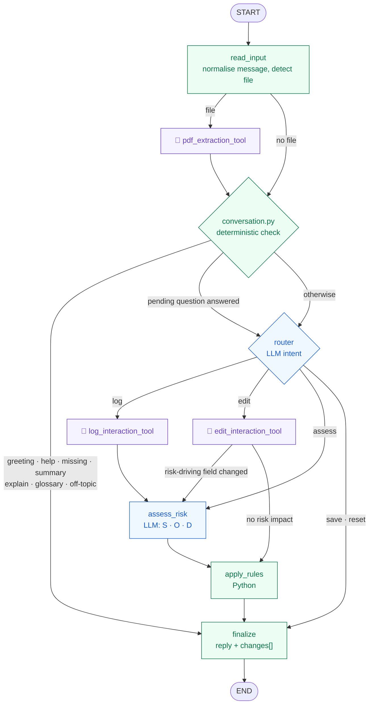
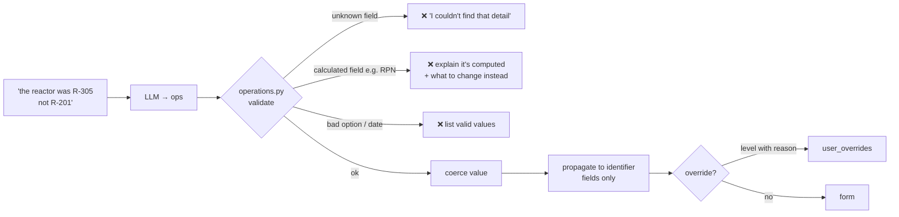

# 🤖 Agents

This file has two parts:

1. [**The deviation agent**](#part-1--the-deviation-agent): how the LangGraph agent inside the product works.
2. [**Working on this repo**](#part-2--working-on-this-repo): commands, conventions and guardrails for contributors
   and automated coding agents.

---

# Part 1: The deviation agent

## 1.1 Graph

🟣 `@tool` functions · 🔵 LLM nodes · 🟢 deterministic

## 1.2 Nodes and tools

| Node | File | LLM | Input → output |
|---|---|:-:|---|
| `read_input` | `ai/graph.py` | – | request → normalised message, file flag |
| `pdf_extraction_tool` | `ai/tools.py` → `reader.py` | – | bytes → text + method (*PDF text layer*, *scanned PDF OCR*, *image OCR*, *email parser*) |
| conversation check | `ai/conversation.py` | – | message + form → canned intent or pass-through |
| `router` | `ai/graph.py` | ✅ | message → `log · edit · assess · save · reset · chat · off_topic` |
| `log_interaction_tool` | `ai/tools.py` | ✅ | source text → Tier-A JSON (null when not stated) |
| `edit_interaction_tool` | `ai/tools.py` | ✅ | instruction + history → `[{field, action: set\|clear, value, reason?}]` |
| `assess_risk` | `ai/graph.py` | ✅ | form → S, O, D (1–5), reasoning, impact, next action, SOP |
| `apply_rules` | `rules.py` | – | form → RPN, level, CAPA, due date, magnitude, repeat |
| `finalize` | `ai/graph.py` | – | state → `{intent, reply, form, changes[], missing_fields, user_overrides, action}` |

## 1.3 The edit pipeline

## 1.4 Guardrails

| # | Guardrail | Where |
|---|---|---|
| 1 | Tier-A extraction limited to facts stated in the source; otherwise null | `prompts.py` `EXTRACT_SYSTEM` |
| 2 | Tier-C fields never written by the AI unless a person states them in chat | `fields.py` tiers + `operations.py` |
| 3 | Calculated fields (RPN, level, CAPA, due date) cannot be set directly | `operations.computed_field_hint` |
| 4 | Relevance gate: ≥ 2 deviation facts before a paste or file replaces the form | `conversation.py` |
| 5 | Off-topic filter: personal statements, jokes and code are refused | `conversation.py` + router |
| 6 | No edits, rules or save on an empty form | `graph.py` |
| 7 | Future *date detected* rejected; relative dates resolved | `fields.coerce_value` |
| 8 | Voice silence / filler hallucinations rejected | `speech.is_hallucination` + client level meter |
| 9 | LLM: JSON mode, temperature 0, one retry, clear errors | `ai/llm.py` |

## 1.5 Memory

The client sends the last chat turns as `history`. Two mechanisms use them:

- **Pending questions.** If the assistant's last message asked something ("What severity should it be?")
  and the user replies "4", `pending_question()` rewrites the message as
  `request (You asked: "…" The user answered: "4")` before routing.
- **Edit context.** `edit_interaction_tool` receives a condensed transcript, so "no, the other one" resolves.

## 1.6 Prompts

All prompts live in [`backend/app/ai/prompts.py`](backend/app/ai/prompts.py). Field lists inside the prompts
are generated from the registry, so they never drift.

| Prompt | Used by | Key rules |
|---|---|---|
| `ROUTER_SYSTEM` / `_USER` | router | intent examples, including off-topic |
| `EXTRACT_SYSTEM` / `_USER` | log tool | stated facts only, strict JSON, ISO dates |
| `EDIT_SYSTEM` / `_USER` | edit tool | 10 rules: set vs clear, overrides need a reason, use the conversation, tolerate typos |
| `RISK_SYSTEM` / `_USER` | assess_risk | FMEA scales; the current values are authoritative |
| `CHAT_SYSTEM` / `_USER` | fallback | plain language, no jargon |

---

# Part 2: Working on this repo

## 2.1 Commands

| Task | Command |
|---|---|
| Run everything | `docker compose up -d --build` → <http://localhost:8080> |
| Backend dev | `cd backend && .venv\Scripts\activate && uvicorn app.main:app --port 8000` |
| Frontend dev | `cd frontend && npm run dev` → <http://localhost:5173> |
| Backend tests | `cd backend && .venv\Scripts\python -m pytest -q` |
| Smoke test (server running) | `cd backend && .venv\Scripts\python scripts\smoke_test.py` |
| Type check | `cd frontend && npx tsc --noEmit -p .` |
| Frontend build | `cd frontend && npm run build` |
| Regenerate DDL | `cd backend && .venv\Scripts\python scripts\dump_schema.py` |

## 2.2 Conventions

- **Add a field in `backend/app/fields.py` only.** Pick its tier carefully. Then regenerate `db/schema.sql`.
- **Numbers belong in `rules.py`.** Never ask the LLM for a value that can be calculated.
- **User-facing text is plain language.** Use `ai/wording.py` (backend) and `src/plainLanguage.js` (frontend)
  for labels. Don't say "Tier A" or "RPN" in replies without explaining them.
- **Prompts live in `prompts.py`.** Don't inline prompt strings in other files.
- **Styling uses design tokens** from [DESIGN_SYSTEM.md](DESIGN_SYSTEM.md). Don't hard-code colours.
- **Match the surrounding code**: comment density, naming, idioms. Comments explain *why*, not *what*.

## 2.3 Definition of done

- [ ] `pytest -q` passes; new behaviour has a test
- [ ] `tsc --noEmit` and `npm run build` are clean
- [ ] No hard-coded colours or new CSS that duplicates a token
- [ ] Works in light **and** dark theme, and with reduced motion
- [ ] No secrets in code; `.env` files untouched in git
- [ ] Docs updated if behaviour, fields or endpoints changed

## 2.4 Never

- Commit `.env`, `backend/.env` or API keys.
- Let the AI write a Tier-C field or a calculated field.
- Make form fields directly editable (it would break the audit trail).
- Publish the app port on `0.0.0.0` or push the repo to a public host.
