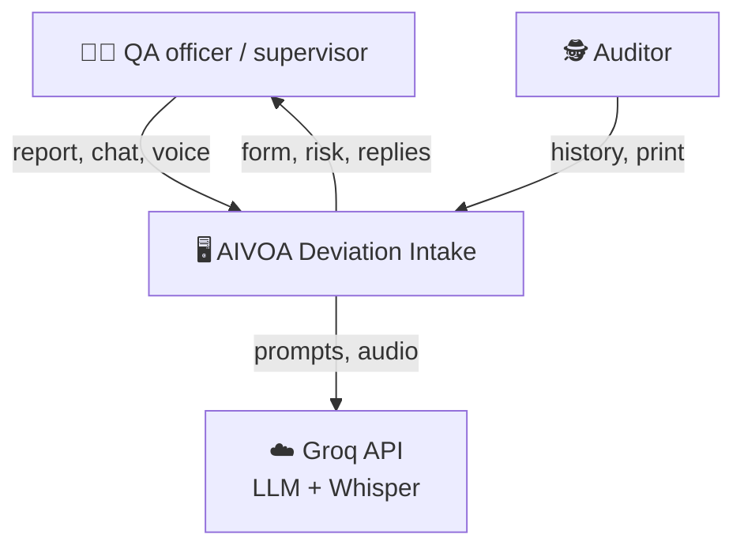
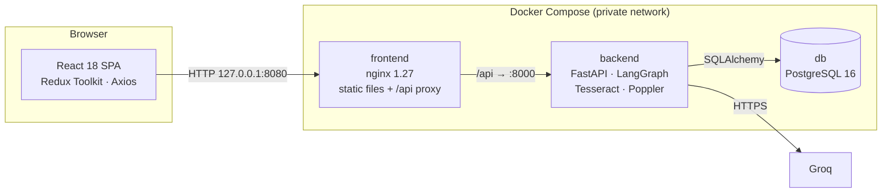
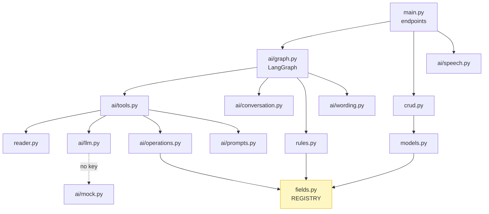
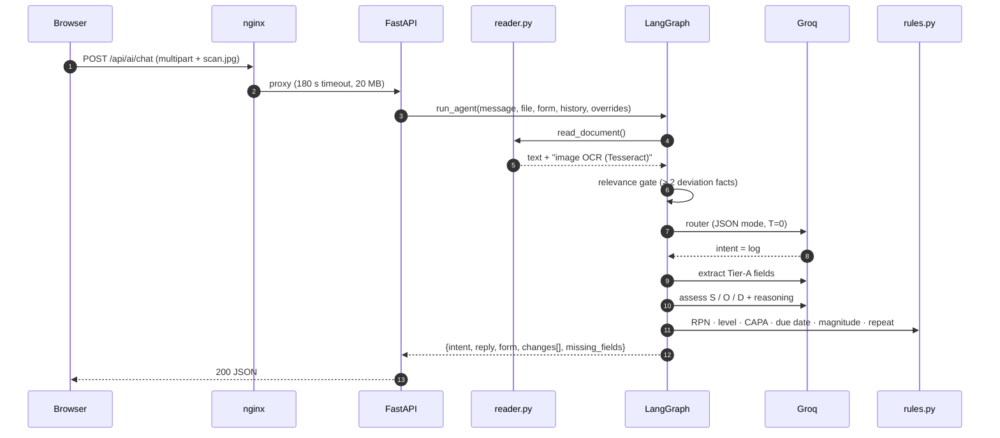
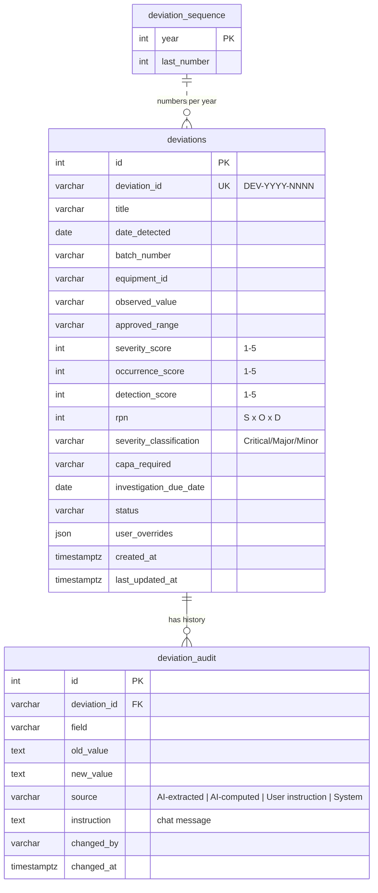
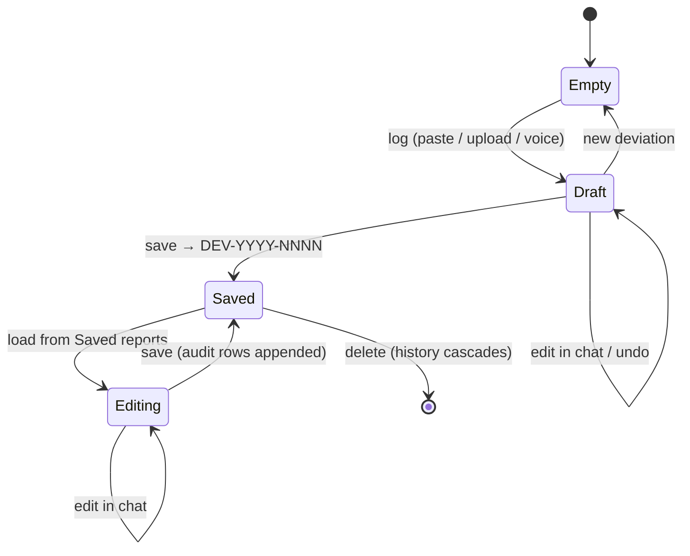
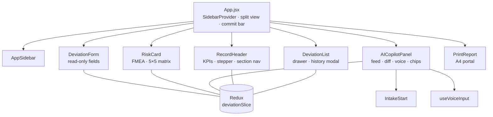
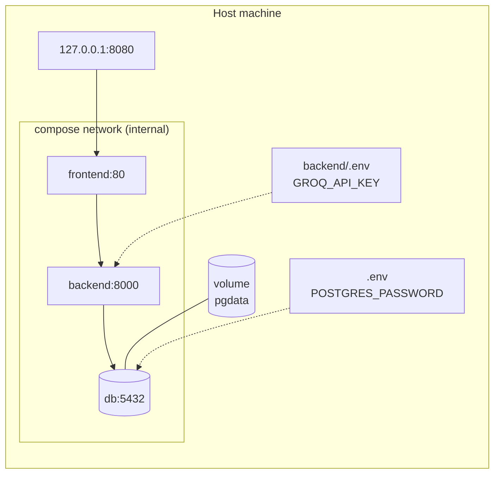

# 🏗️ Architecture

> [!NOTE]
> Diagrams are written in Mermaid, which GitHub renders them automatically. Click a diagram to zoom or pan.

**Contents:** [Context](#1-system-context) · [Containers](#2-containers) · [Backend modules](#3-backend-modules) ·
[Request lifecycle](#4-request-lifecycle) · [Data model](#5-data-model) · [Record states](#6-record-lifecycle) ·
[Frontend](#7-frontend) · [Deployment](#8-deployment) · [Decisions](#9-key-decisions)

---

## 1. System context



## 2. Containers



| Container | Image | Published | Health check |
|---|---|---|---|
| `frontend` | node:20-slim build → nginx:1.27-alpine | `127.0.0.1:8080` | Waits for the backend to be healthy |
| `backend` | python:3.11-slim + tesseract-ocr + poppler-utils | none | `GET /api/health` |
| `db` | postgres:16-alpine | none | `pg_isready` |

## 3. Backend modules



`fields.py` is the **single source of truth**. The form layout, the AI prompts, validation, the database columns
and `db/schema.sql` are all derived from it. Adding a field there adds it everywhere.

## 4. Request lifecycle



<details>
<summary><b>Error paths</b></summary>

| Failure | Behaviour |
|---|---|
| Unsupported / empty file | 422 with a plain message shown in chat |
| No text found (blank scan) | "No readable text was found in the document." |
| LLM rate limit / timeout | One retry, then a friendly chat message; the form is untouched |
| Invalid LLM JSON | One retry with a stricter instruction |
| No Groq key | Mock mode for chat; browser speech recognition for voice |
| Silent voice clip | Rejected before or after transcription with microphone guidance |

</details>

## 5. Data model



<sub>`deviations` has one column per registry field (≈ 45); only representative columns are shown.</sub>

**ID generation.** `deviation_sequence` is locked with `SELECT … FOR UPDATE`, so IDs are unique under
concurrency and never reused after a delete.

## 6. Record lifecycle



Workflow `status` (shown in the stepper): **Draft → Open → Under Investigation → Pending QA Approval → Closed**.

## 7. Frontend



<details>
<summary><b>Redux state shape</b></summary>

```js
{
  registry,                      // field definitions from GET /api/fields
  form: { [key]: value },        // current record
  userOverrides: { [key]: { value, reason } },
  changeLog: Change[],           // unsaved changes, sent with save
  messages: ChatMessage[],       // copilot feed (also the history for memory)
  highlight: { fields, token },  // drives the flash animation
  past: Snapshot[],              // undo stack
  copilotStatus,                 // idle | working | done
  currentId, dirty, savedList, audit,
  loading, saving, error, notice, mockMode, model
}
```

</details>

## 8. Deployment



| Setting | Where | Default |
|---|---|---|
| `POSTGRES_PASSWORD` | root `.env` (required) | none |
| `APP_PORT` | root `.env` | `8080` |
| `GROQ_API_KEY`, `GROQ_MODEL`, `GROQ_WHISPER_MODEL` | `backend/.env` | Mock mode · `openai/gpt-oss-120b` · `whisper-large-v3-turbo` |
| `CORS_ORIGINS` | compose env | `http://localhost:8080` |

## 9. Key decisions

| # | Decision | Why | Trade-off |
|---|---|---|---|
| 1 | **Read-only form, chat-only edits** | Every change gets a source and an instruction for the audit trail | Less direct than typing in a field |
| 2 | **Rules in Python, not the LLM** | Reproducible, testable, explainable risk | Rules need code changes to tune |
| 3 | **Field registry drives everything** | The UI, AI, DB and validation can never disagree | One more abstraction to learn |
| 4 | **Deterministic conversation layer first** | Greetings, help and guardrails work without the LLM and cannot hallucinate | Keyword lists need upkeep |
| 5 | **LangGraph over a single prompt** | Explicit, inspectable steps; conditional re-assessment | More moving parts |
| 6 | **Same-origin `/api` via nginx** | One URL, no CORS in production | nginx config to maintain |
| 7 | **Transcript never auto-sent** | A misheard batch number must be caught by a person | One extra click |
