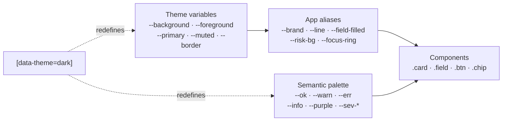
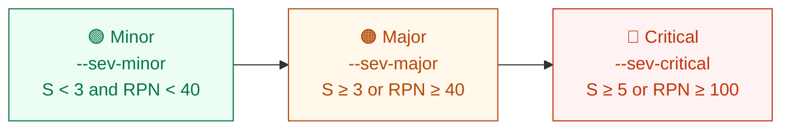
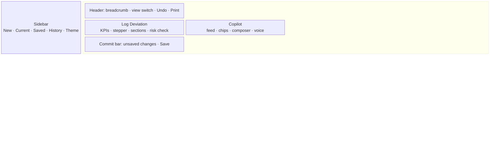
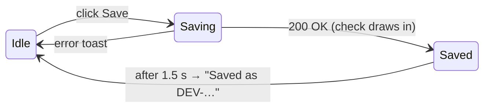

# 🎨 Design System

A calm, neutral, enterprise QMS look. Colour is reserved for **meaning** (risk level, source of a value, status),
never for decoration.

| Principle | In practice |
|---|---|
| **Trust through provenance** | Every value shows where it came from: report, calculated, or person |
| **Calm by default** | Neutral surfaces with black/white primary; colour only for status |
| **Motion answers actions** | Animations confirm what just changed; nothing loops for decoration |
| **Plain language** | "Risk score", not "RPN"; "From the report", not "Tier A" |

Sources: [`frontend/src/index.css`](frontend/src/index.css) (theme variables) ·
[`frontend/src/styles.css`](frontend/src/styles.css) (app tokens and components).

---

## 1. Token architecture

Themes switch by setting `data-theme="light" | "dark"` on `<html>`. The default is **light**, and the choice is
remembered per browser.

## 2. Colour

### Neutrals (OKLCH)

| Token | Light | Use |
|---|---|---|
| `--background` | `oklch(1 0 0)` | Page, cards |
| `--foreground` | `oklch(0.145 0 0)` | Body text |
| `--primary` | `oklch(0.205 0 0)` | Primary buttons, active items |
| `--muted` | `oklch(0.97 0 0)` | Subtle fills, empty fields |
| `--muted-foreground` | `oklch(0.556 0 0)` | Secondary text |
| `--border` | `oklch(0.922 0 0)` | Hairlines, card borders |
| `--destructive` | `oklch(0.577 0.245 27.3)` | Delete actions |

### Semantic

| | Token | Light | Dark | Meaning |
|---|---|---|---|---|
|  | `--ok` | `#067647` | `#4ecb8d` | Saved, Minor, complete |
|  | `--warn` | `#a4400a` | `#f8b545` | Unsaved changes, due soon |
|  | `--err` | `#b42318` | `#f97a70` | Errors, Critical |
|  | `--info` | `#175cd3` | `#6cbcfd` | From the report (Tier A) |
|  | `--purple` | `#6941c6` | `#bd9cf7` | Calculated (Tier B) |
|  | `--flash-border` | `#eab308` | amber 65 % | Just changed |

Each semantic colour has `-bg` and `-border` companions for badges and callouts.

### Risk levels

## 3. Typography

| Role | Font | Size / weight |
|---|---|---|
| Body & UI | **Geist Variable** → Inter → system-ui | 14 px / 1.5 |
| Section heading | Geist | 12 px / 600, uppercase, 0.08 em tracking, muted |
| KPI figure | Geist | 17 px / 600, tabular numbers |
| Meta & counts | Geist | 12 px, muted, tabular numbers |
| Code & IDs | `--mono` (SF Mono, Cascadia Mono, Consolas) | inherits size |

## 4. Shape, depth and spacing

| Token | Value | Use |
|---|---|---|
| `--r-xs` | `0.5rem` | Icon tiles, small controls |
| `--r-sm` | `0.625rem` | Inputs, buttons, list rows |
| `--r` | `0.875rem` | Cards, panels |
| `--r-lg` | `1rem` | Overlays, dialogs |
| `--pill` | `999px` | Badges, chips |
| `--shadow-xs` | 1 px hairline | Resting cards |
| `--shadow-md` | 4/12 px soft | Hover, popovers |
| `--shadow-lg` | 16/32 px | Drawers, dialogs |

Spacing follows a **4 px grid** (4 · 8 · 12 · 16 · 24 · 32).

## 5. Layout

- **≥ 1100 px:** a resizable split (form | copilot). The divider position is remembered.
- **< 1100 px:** a tabbed view switch between *Form* and *Copilot*.
- **Sidebar:** collapsible to icons; it becomes a sheet on mobile.

## 6. Components

| Component | Anatomy | States |
|---|---|---|
| **Field** | label · source chip · value · flash | empty · filled · just changed · overridden |
| **Source chip** | icon + "From the report" / "Calculated" / "Set by you" | info · purple · ok |
| **KPI card** | label · count-up number · caption | idle · pop on change |
| **Stepper** | 5 dots + connector | done · current (pulse once) · upcoming |
| **Risk matrix** | 5×5 S × O grid | the active cell pops; diagonal stagger on first show |
| **Copilot message** | avatar · text · tool chips · change table | enter slide-up · working (typing dots) |
| **Button** | primary · secondary · ghost · destructive | hover lift · press 0.97 · loading · success ✓ |
| **Toast** | icon · text · countdown bar | enter · paused on hover · dismiss |
| **Print report** | A4 header · summary · KV tables · risk · history · sign-off | screen preview · paper |

## 7. Motion

| Token | Value |
|---|---|
| `--ease` | `cubic-bezier(0.16, 1, 0.3, 1)` |
| Hover / press | 150 ms |
| Enter / exit | 200–300 ms |
| Field-fill stagger | 28 ms per field, capped at 24 fields |
| Count-up | 600 ms ease-out |

> [!IMPORTANT]
> Every animation is disabled under `prefers-reduced-motion: reduce`, and values then update instantly.

## 8. Accessibility checklist

- [x] Text contrast ≥ 4.5 : 1 in both themes
- [x] Visible focus ring (`--focus-ring`) on every interactive element
- [x] Full keyboard use: Enter sends, Shift+Enter adds a new line, Escape closes overlays and cancels recording
- [x] Confirm dialogs move focus to the safe (Cancel) action
- [x] Status is never shown by colour alone: level text, icons and labels are always present
- [x] `role=status` / `role=alert` regions announce copilot progress, voice state and errors
- [x] Reduced-motion support

## 9. Voice and tone

| ✅ Say | 🚫 Avoid |
|---|---|
| "I filled in 19 of 20 details from the image." | "Extraction pipeline completed." |
| "Not in the report, so I left these blank: likely cause." | "Null values for: root_cause_hypothesis." |
| "Risk: Major (severity 4 × likelihood 2 × hard to detect 3 = 24)." | "RPN=24, class=MAJOR." |
| "I couldn't hear any speech. Check the microphone." | "Error 422." |
