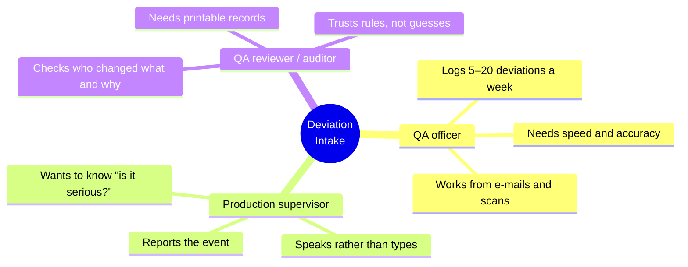
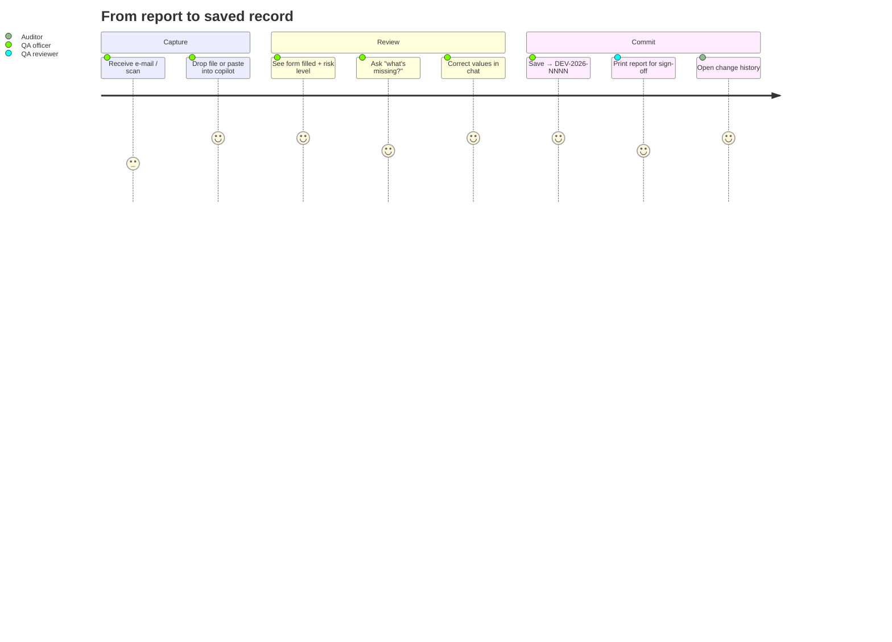
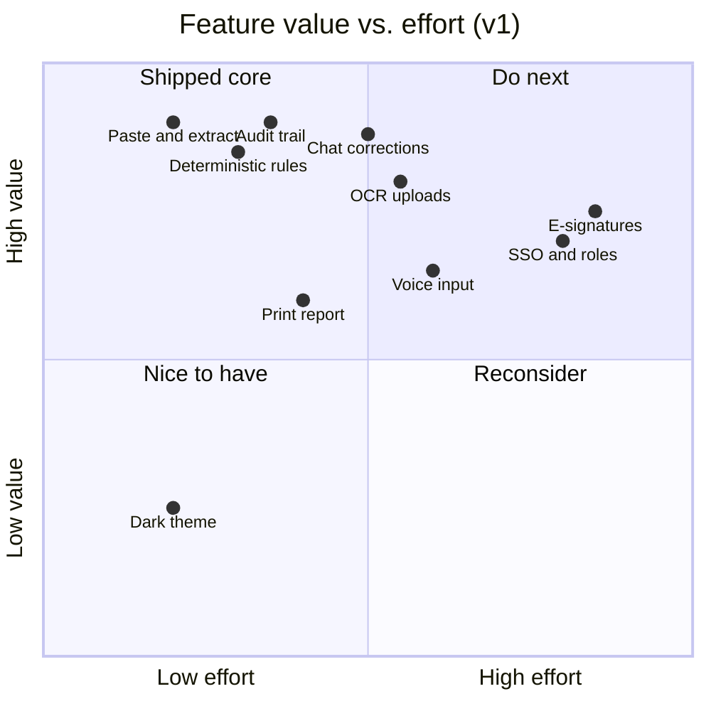
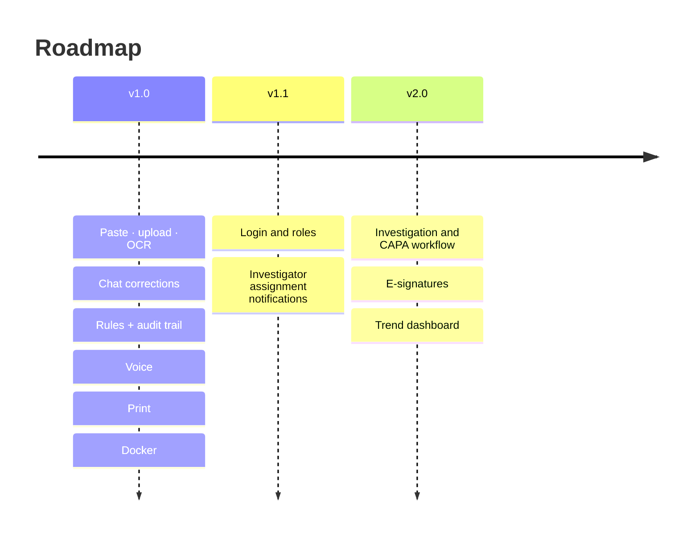

# 📋 Product Requirements: Deviation Intake Module

| | |
|---|---|
| **Product** | AIVOA QMS · Deviation Intake |
| **Status** | v1.0 implemented |
| **Users** | QA officers, production supervisors, QA reviewers at an API manufacturing site |
| **Related** | [README](README.md) · [Architecture](ARCHITECTURE.md) · [Agents](AGENTS.md) · [Design system](DESIGN_SYSTEM.md) |

---

## 1. Problem

A **deviation** is any departure from an approved process: a temperature excursion, a failed test, a broken
seal. GMP rules require each one to be recorded, risk-assessed and investigated on time.

Today the report arrives as an e-mail, a scanned form or a phone photo. Someone re-types it into the QMS. That is:

- **Slow**: 15–30 minutes per record, and it delays containment decisions.
- **Error-prone**: batch numbers and ranges are mistyped, and the risk scoring is inconsistent between people.
- **Hard to audit**: nobody can tell afterwards which value came from the report and which was a guess.

## 2. Goals and non-goals

| ✅ Goals | 🚫 Non-goals (v1) |
|---|---|
| Fill the Log Deviation form from any common input in < 1 min | Full investigation / CAPA workflow |
| Never invent a fact that is not in the source | Electronic signatures (21 CFR Part 11 e-sign) |
| Compute risk with transparent, reproducible rules | Multi-site tenancy, SSO, role permissions |
| Let people correct anything in plain language | Direct editing of form fields |
| Keep a complete, per-field audit trail | Public internet deployment |

## 3. Personas

## 4. User journey

## 5. User stories and acceptance criteria

<b>Epic 1: Capture</b>

| ID | As a… | I want… | Acceptance criteria |
|---|---|---|---|
| C-1 | QA officer | to paste a report | Tier-A fields filled only with stated facts. Missing facts listed, not invented. |
| C-2 | QA officer | to upload PDF / JPG / PNG / EML | Text layer used when present, otherwise OCR. The extraction method is shown. |
| C-3 | Supervisor | to speak the report | Transcript placed in the input for review. Silence is detected and never turned into text. |
| C-4 | QA officer | irrelevant input rejected | A shopping list or a greeting never replaces the form |

<b>Epic 2: Assess</b>

| ID | As a… | I want… | Acceptance criteria |
|---|---|---|---|
| A-1 | QA officer | an initial risk level | S/O/D from the AI; RPN, level, CAPA and due date from rules |
| A-2 | Reviewer | to know *why* | "why is it Major?" cites the exact threshold and the reasoning |
| A-3 | QA officer | to override with a reason | The override is stored with its reason, and the rules never overwrite it |
| A-4 | QA officer | the excursion size | "+6 °C above upper limit 65 °C (9.2 % over)" is calculated from the range and the observed value |

<b>Epic 3: Correct and commit</b>

| ID | As a… | I want… | Acceptance criteria |
|---|---|---|---|
| E-1 | QA officer | to set / clear / fix values in chat | Only the named fields change. The reply names them. |
| E-2 | QA officer | to undo | The previous snapshot is restored. Nothing reaches the audit trail. |
| E-3 | QA officer | to save | A unique `DEV-YYYY-NNNN` that is never reused, even after a delete |
| E-4 | Auditor | a change history | One row per field: old → new, source, instruction, user, time |
| E-5 | Reviewer | a printable report | Clean A4 with sections, risk, history and a sign-off block |

## 6. Functional scope

## 7. Non-functional requirements

| Area | Requirement |
|---|---|
| **Data integrity** | ALCOA+: every value is attributable to a source; the AI never writes Tier-C fields |
| **Determinism** | Rules are pure Python, with temperature 0 for the LLM and JSON mode with one retry |
| **Privacy** | Runs locally; bound to `127.0.0.1`; secrets only in git-ignored `.env` files |
| **Resilience** | Rate limits and LLM errors give a clear chat message; the app keeps working in Mock mode |
| **Accessibility** | Keyboard reachable, visible focus, `prefers-reduced-motion` respected, WCAG AA contrast |
| **Performance** | Text log < 10 s, OCR upload < 30 s, UI interactions < 100 ms |

## 8. Success metrics

| Metric | Target |
|---|---|
| Time from report to saved record | **< 2 min** (vs. 15–30 min manual) |
| Tier-A fields filled from a complete report | **≥ 90 %** |
| Invented values in Tier-C fields | **0** |
| Risk-level agreement with a senior QA reviewer | **≥ 85 %** |
| Saved records with a complete audit trail | **100 %** |

## 9. Release plan

## 10. Risks

| Risk | Mitigation |
|---|---|
| LLM hallucinates a fact | Tier-A extraction limited to stated facts; Tier C never AI-written; human review before save |
| OCR misreads a batch number | The extraction method is shown; values flash for review; correction by chat |
| Voice mishears | The transcript is never auto-sent; vocabulary prompt; silence filter |
| LLM API unavailable | Mock mode parser; clear error messages |
