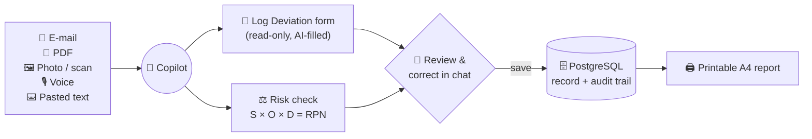
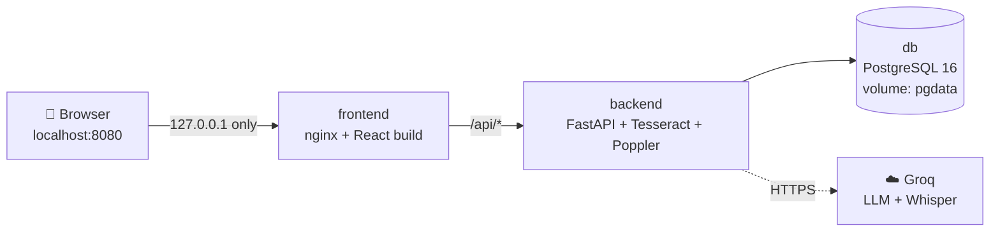
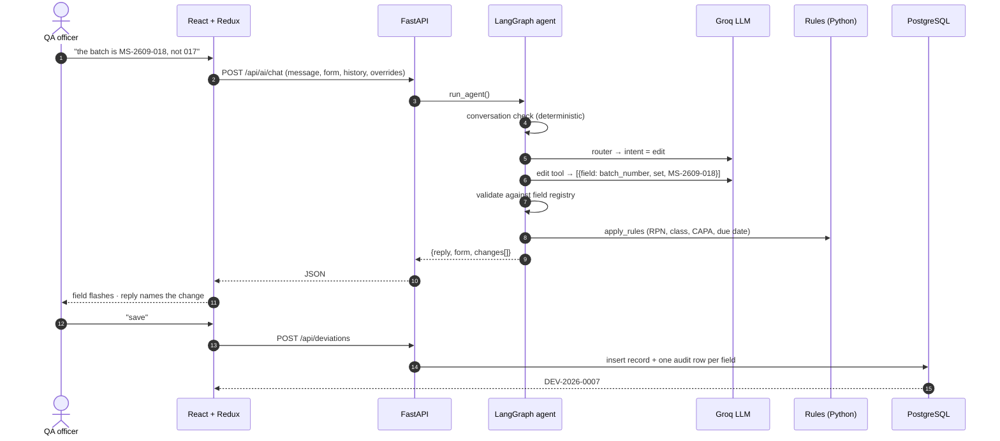
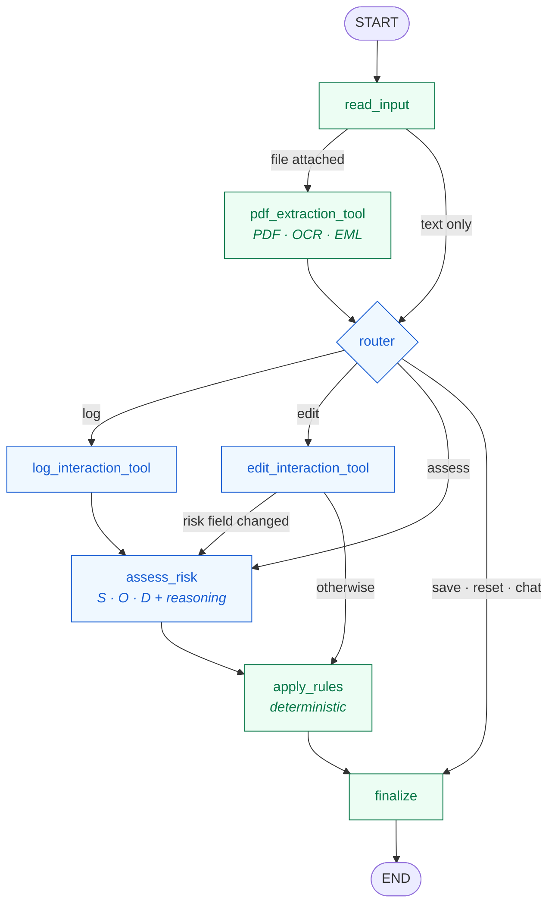
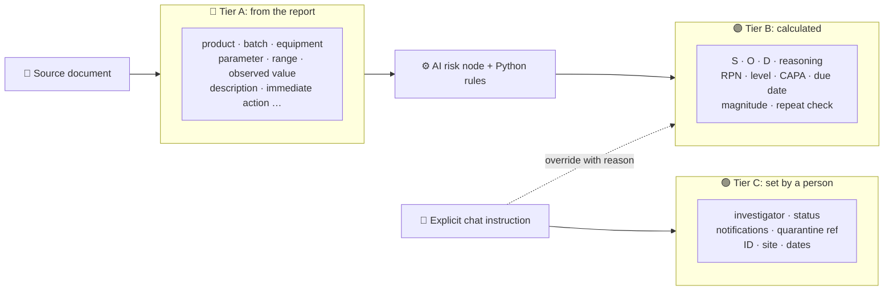

<div align="center">

# AIVOA · Deviation Intake

**Turn a messy deviation report into a complete, risk-assessed, audit-ready QMS record in under a minute.**

Paste an e-mail, drop a PDF, snap a photo or just speak. The copilot fills the form, scores the risk,
and every correction you make in chat lands in a tamper-evident audit trail.


[**Quick start**](#-quick-start) ·
[**How it works**](#-how-it-works) ·
[**Features**](#-features) ·
[**Docs**](#-documentation) ·
[**API**](#-api) ·
[**Project layout**](#-project-layout)

</div>

---

## 🧭 At a glance

> [!TIP]
> **Example.** A reactor reads **71 °C** against an approved range of **60–65 °C**. The copilot records
> *"+6 °C above upper limit 65 °C (9.2 % over)"*, classifies it **Major**, flags **CAPA required** and sets the
> investigation due date **30 days** out. Every number comes from deterministic rules, not from the language model.



| | |
|---|---|
| **Problem** | Deviation reports arrive as free text in many formats. Re-typing them into a QMS is slow, error-prone and hard to audit. |
| **Solution** | An AI copilot that extracts only facts stated in the source, computes risk with auditable rules, and lets people correct everything in plain language. |
| **Guarantee** | The form is read-only. Every value has a source (document, AI, rule or person), and every change is written to `deviation_audit`. |

---

## 🚀 Quick start

<details open>
<summary><b>Option A: Docker (recommended, nothing else to install)</b></summary>

<br/>

Requires [Docker Desktop](https://www.docker.com/products/docker-desktop/).

```powershell
copy backend\.env.example backend\.env     # add your GROQ_API_KEY (optional: without it = Mock mode)
python -c "import secrets;open('.env','w').write('POSTGRES_PASSWORD='+secrets.token_urlsafe(24)+'\n')"
docker compose up -d --build               # first build takes a few minutes
```

Open **<http://localhost:8080>**.



| Command | What it does |
|---|---|
| `docker compose ps` | Status: all three services should be *Up / healthy* |
| `docker compose logs -f backend` | Live backend logs |
| `docker compose down` | Stop (saved deviations are kept) |
| `docker compose down -v` | Stop **and delete** all saved deviations |

> [!IMPORTANT]
> **Private by default.** The app binds to `127.0.0.1`, so other machines on the network cannot reach it. The
> database and API publish no ports. The database password lives in the git-ignored root `.env`, and API keys
> stay in `backend/.env`, which is excluded from the images. nginx hides its version and sends anti-framing
> headers. The app has **no login**, so do not expose it to the internet as-is.

</details>

<details>
<summary><b>Option B: Local development (two terminals)</b></summary>

<br/>

| Tool | Version | Why |
|------|---------|-----|
| Python | 3.11+ | backend |
| Node.js | 18+ | frontend |
| PostgreSQL | 14+ | deviations + audit trail |
| Tesseract OCR | 5.x | photos and scanned PDFs |
| Poppler | any | *only* for scanned PDFs |

```powershell
# terminal 1: backend
cd backend
python -m venv .venv
.venv\Scripts\activate                # macOS/Linux: source .venv/bin/activate
pip install -r requirements.txt
copy .env.example .env                # set GROQ_API_KEY, DATABASE_URL, TESSERACT_CMD
uvicorn app.main:app --port 8000

# terminal 2: frontend
cd frontend
npm install
npm run dev                           # http://localhost:5173
```

Tables are created on startup (DDL for review: [`db/schema.sql`](db/schema.sql)).
Health: <http://localhost:8000/api/health> · Interactive API docs: <http://localhost:8000/docs>

**Windows notes**
- PostgreSQL: `psql -U postgres -c "CREATE DATABASE aivoa_qms;"`
- Tesseract: UB-Mannheim build, then set `TESSERACT_CMD` in `backend/.env`.
- Poppler (optional): set `POPPLER_PATH` to its `Library\bin` folder.
- Groq key: free at <https://console.groq.com/keys>. The free tier allows ~8k tokens/min, and one document uses ~4–5k.

</details>

<details>
<summary><b>No API key? Mock mode</b></summary>

<br/>

Without `GROQ_API_KEY`, an offline rule-based parser replaces the LLM and a **Mock mode** badge appears.
Everything still works end to end, including the browser's own speech recognition for voice input (Chrome / Edge).

</details>

---

## ⚙️ How it works

### One chat message, end to end



### The agent graph



<sub>🔵 uses the LLM · 🟢 deterministic Python</sub>

Full details are in [**ARCHITECTURE.md**](ARCHITECTURE.md) and [**AGENTS.md**](AGENTS.md).

### Who may write each field

In GMP manufacturing, a hallucinated batch number is a **data-integrity failure** (ALCOA+). So every field
declares who is allowed to write it, in one registry: [`backend/app/fields.py`](backend/app/fields.py).



<details>
<summary><b>Risk rules (deterministic, unit-tested)</b></summary>

<br/>

| Output | Rule |
|---|---|
| **RPN** | Severity × Occurrence × Detection (each 1–5) |
| **Level** | **Critical** if S ≥ 5 or RPN ≥ 100 · **Major** if S ≥ 3 or RPN ≥ 40 · else **Minor** |
| **CAPA required** | Critical or Major, or RPN ≥ 60 |
| **Investigation due** | Critical +15 days · Major +30 · Minor +45 |
| **Magnitude** | Parses `60-65 °C`, `NMT 0.5%`, `NLT 98%`, `2.0 ± 0.2` into *"+6 °C above upper limit (9.2 % over)"* |
| **Repeat deviation** | Same equipment, or same product + parameter, already in the database |

A person can override the level with a reason (*"severity should be Critical because the batch was quarantined"*).
The override is stored in `user_overrides`, and the rules never overwrite it.

</details>

---

## ✨ Features

| | Feature | Details |
|---|---|---|
| 📥 | **Any input** | Pasted text, `.eml`, PDF (text layer, with OCR fallback for scans), JPG/PNG via Tesseract |
| 🎙️ | **Voice** | Groq Whisper with a pharma vocabulary prompt. The transcript goes to the chat box for review and is never sent automatically. Silent microphones are detected. |
| 💬 | **Chat-only corrections** | *"clear the equipment ID"*, *"assign Dr. Priya Rao as investigator"*, *"the reactor was R-305 not R-201"* |
| 🧠 | **Conversation memory** | Follow-up answers ("yes, 4") are linked to the question just asked |
| 🛡️ | **Guardrails** | Off-topic filter, relevance gate before logging, no edits on an empty form, future dates rejected |
| ⚖️ | **Risk check** | FMEA-style S/O/D, 5×5 matrix, plain-language reasoning with the exact rule that fired |
| 🧾 | **Audit trail** | One row per changed field: old → new, source, the chat instruction, who and when |
| ↩️ | **Undo** | Restores the previous snapshot. Undone edits never reach the audit trail. |
| 🖨️ | **Print report** | Clean A4 layout with a summary, sections, risk, change history and sign-off block |
| 🌗 | **Themes** | Bright by default, dark on demand, reduced-motion aware |

<details>
<summary><b>What you can say to the copilot</b></summary>

<br/>

| You say | What happens |
|---|---|
| "hi", "thanks", "ok" | Short, context-aware reply |
| "help", "what can you do" | Capabilities with example commands |
| "what's missing?" | Fields not found in the source, plus open human decisions |
| "summarize" | Recap: what, excursion, risk, containment, status |
| "why is it Major?" | S × O × D = RPN, the threshold that fired, the reasoning or the override reason |
| "what is RPN / CAPA / GMP / OOS?" | Plain-language definitions with this app's thresholds |
| "what did you change?" | The last applied edit |
| "undo" | Reverts the last change |
| "I am staying in Salem", jokes, weather | Polite refusal. **The form is never touched.** |

</details>

---

## 📚 Documentation

| Document | What's inside |
|---|---|
| 📋 [**PRD.md**](PRD.md) | Product requirements: users, goals, user stories, scope, success metrics |
| 🏗️ [**ARCHITECTURE.md**](ARCHITECTURE.md) | System context, containers, data model, request lifecycle, deployment |
| 🤖 [**AGENTS.md**](AGENTS.md) | The LangGraph agent, its tools and prompts, plus conventions for contributors and coding agents |
| 🎨 [**DESIGN_SYSTEM.md**](DESIGN_SYSTEM.md) | Tokens, colour, type, components, motion and accessibility rules |
| ✅ [**QA_REPORT.md**](QA_REPORT.md) | Regression pass: flows tested, bugs found and fixed |

---

## 🔌 API

| Method | Path | Purpose |
|---|---|---|
| `GET` | `/api/health` | Mock mode, model, database and Tesseract status |
| `GET` | `/api/fields` | Field registry (drives the form) |
| `POST` | `/api/ai/chat` | Run the agent (multipart: message, optional file, form, history, overrides) |
| `POST` | `/api/ai/transcribe` | Voice clip → text for review |
| `POST` | `/api/deviations` | Save a new record (`DEV-YYYY-NNNN`) |
| `GET` | `/api/deviations` | List saved records |
| `GET` · `PUT` · `DELETE` | `/api/deviations/{id}` | Load · update · delete |
| `GET` | `/api/deviations/{id}/audit` | Change history |

---

## 🧪 Tests

```powershell
cd backend
.venv\Scripts\python -m pytest -q            # 149 tests: rules, registry, reader, tools, CRUD, guardrails, voice
.venv\Scripts\python scripts\smoke_test.py   # end to end against a running server: log → edits → save → audit
```

---

## 🗂️ Project layout

<details>
<summary><b>Expand the tree</b></summary>

```
backend/
  app/main.py              FastAPI endpoints, CORS, startup table creation
  app/fields.py            field registry: tiers, options, validation (single source of truth)
  app/rules.py             deterministic risk rules
  app/reader.py            PDF / OCR / EML / TXT → text
  app/models.py, db.py     SQLAlchemy models (columns generated from the registry)
  app/crud.py              save / update with one audit row per changed field
  app/ai/graph.py          LangGraph agent
  app/ai/tools.py          pdf_extraction_tool · log_interaction_tool · edit_interaction_tool
  app/ai/prompts.py        all prompts
  app/ai/conversation.py   deterministic intents + guardrails
  app/ai/speech.py         voice transcription
  app/ai/wording.py        plain-language labels for replies
  tests/                   pytest suite
  Dockerfile
db/schema.sql              DDL (generated from the registry)
frontend/
  src/App.jsx              shell: sidebar, split view, commit bar, print
  src/features/            Redux slice, voice hook
  src/components/          form, copilot, risk card, record header, list, print report
  src/components/ui/       UI primitives (button, sidebar, sheet, tooltip …)
  src/styles.css           design tokens + component styles
  Dockerfile, nginx.conf
docker-compose.yml
```

</details>

<details>
<summary><b>Five files to read first</b></summary>

1. [`backend/app/ai/graph.py`](backend/app/ai/graph.py): the agent
2. [`backend/app/fields.py`](backend/app/fields.py): the registry
3. [`backend/app/rules.py`](backend/app/rules.py): the risk maths
4. [`backend/app/ai/tools.py`](backend/app/ai/tools.py): the three tools
5. [`frontend/src/features/deviationSlice.js`](frontend/src/features/deviationSlice.js): client state

</details>

---

<div align="center">
<sub>Built for regulated manufacturing: facts from the source, numbers from rules, decisions from people.</sub>
</div>
